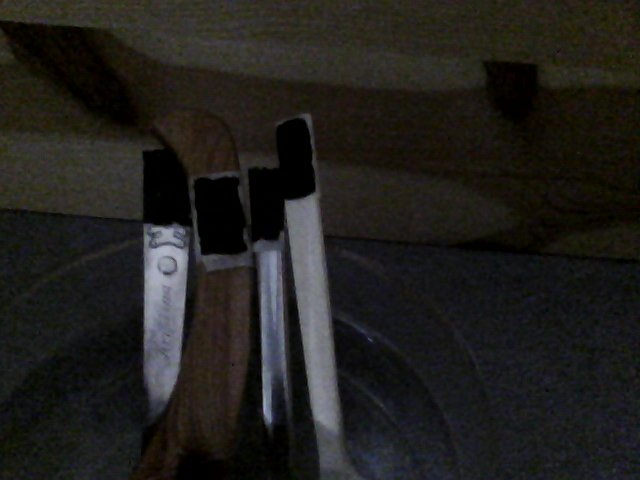

### Energin leds bort

#### Frågeställningar

Hur bra är olika material på att leda värme.

#### Materiel

En skål. Hett vatten. En träsked, en metallsked och en plastsked. Kanske något av glas eller valfritt. 
En IR-kamera.
Föremålen som man ska mäta på med IR-kameran ska ha en tejpbit som är svart på det område där mätningen ska ske (vanlig målartejp svartmålad med tuschpenna). Detta på grund av att emissiviteten kan variera kraftigt, speciellt kan metaller ha ett annat värde än t.ex. trä.

#### Experiment

    • Placera skedarna i en skål, låt dem luta mot kanten.

    • Mät temperaturen hos skedarna med hjälp av IR-kameran.

    • Koka vatten i en vattenkokare.

    • Häll vattnet i skålen med skedar.

    • Låt stå en minut eller två.

    • Titta på eller ta foto av uppställningen så temperaturen på de olika föremålen kan bestämmas. Det räcker med att avgöra ordningen mellan dem avseende temperatur, noggrann mätning behövs ej. Du kan också känna på föremålen.

#### Uppföljning

    • Vilken ordning har de testade materialen i fråga om värmeledning?

    • Vilket material ska man använda för att få så låg värmeledning som möjligt?

    • Är glas en bättre eller sämre värmeledare än trä? Vad innebär detta för ett fönster i ett hus? En del hus har metall runt fönstret, vad innebär det för värmeledningen?

    • Se i listan över värmeledningsförmåga för några material. Stämmer de med din mätning?Ibland betecknas värmeledningsförmågan med (lambda).