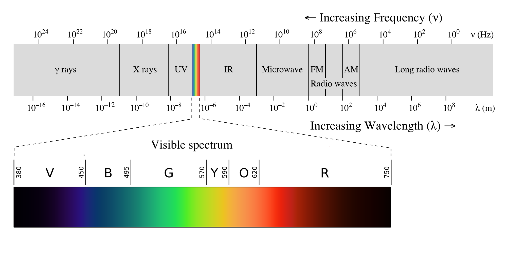

### Energin strålar bort

#### Experiment med IR-kamera

     1. En kopp med kallt vatten och en med varmt vatten ser lika ut för våra ögon men hur ser IR-kameran dem? Vilken kopp avger mest energi i form av strålning? Ljusa färger (vit-gul) är hög temperatur och mörka färger (mörkblå-svart) är låg temperatur.

     2. Undersök om följande föremål är genomskinliga (kan du se koppen med varmt vatten genom materialet) för IR-strålning:

         a) Glasskiva.
         b) Träskiva.
         c) Plastskiva.
         d) Aluminiumfolie.
         e) Svart sopsäck. (Stoppa in din arm, kan man räkna fingrarna?)
         f) Solskydd för bilfönster.
         g) Valfritt.
         h) Reflekterar några av föremålen i listan, a-g, IR-strålning?

     3. Om man tittar på en människokropp med hjälp av en IR-kamera kan man se hur temperaturen varierar. Sjukdomar kan detekteras med en IR-kamera. Var har du högst respektive lägst temperatur på din kropps hud?  Var avger du mest energi i form av strålning? Jämför med katten i bilden. 

     4. Om du har en mobiltelefon undersök om den kan detektera ljuset från en fjärrkontroll (IR-diod) med hjälp av mobilens kamera. Mobiltelefoners kameror är ibland känsliga för IR-strålning.

     5. Undersök er skola.

         a) Var förlorar ert skolhus sin energi?
         b) Var är det speciellt varmt i er skola? Var är det kallt?
         c) Kan IR-kameran se om elementen är på?
         d) Kaffeautomat, fläktar, fönster, lampor…

     6. Från en järnbit med temperaturen  1300 °C kommer så mycket UV-strålning att vi måste skydda våra ögon med UV-skydd. Från solen som är  6000 °C borde det komma mycket stora mängder UV-strålning. Trots det kan vi se ett kort ögonblick på solen utan att ögonen blir förstörda, hur kan det vara så?

#### Information

Föremål med hög temperatur lyser: järn i en smältugn lyser rött, solen är 6000 °C på ytan och lyser vitt för våra ögon.

Föremål med temperaturen 1300 °C lyser för våra ögon med en bländande vit färg; glasögon som skyddar mot ultraviolett (UV) strålning behövs. Vid 950 °C är föremål röda mot orange, och nedåt 500 °C svagt mörkt röda. Vid lägre temperaturer strålar föremål fortfarande men med ljus som inte är synligt för våra ögon. Ett föremål vid rumstemperatur, ca 20 °C, sänder inte ut någon strålning som människan kan se; strålningen som sänds ut ligger i det infraröda (IR) området och längre våglängder, se figur 1. 

Alla föremål avger således elektromagnetisk strålning oavsett temperatur. Universum har en temperatur på cirka  -270 °C, denna strålning kallas för den kosmiska bakgrundsstrålningen och är i mikrovågsområdet.

Med hjälp av en IR-kamera kan vi detektera den infraröda strålningen från föremål i vår omgivning. Eftersom även osynlig infraröd ’färg’, beror på temperaturen kan vi bestämma föremålets temperatur genom att observera ’IR-färgen’ med hjälp av IR-kameran.

#### Kameran

Eftersom vi inte kan se ’IR-färgerna’ ändrar IR-kameran dem till för oss synliga färger, en slags kod. I regel väljer kameran ljusare färger för högre temperaturer, se bilden av katten. Ibland ändrar kameran sin skala beroende på hur stora skillnader i temperatur det är i bilden; då stannar den en stund och kalibrerar om skalan. Temperaturen som anges av kameran gäller för bildens mitt. Kameran har 2 linser så den tar en vanlig bild i det synliga området, letar upp kanter i den bilden och lägger sedan kanterna på IR-bilden; detta för att du lättare ska kunna hitta föremålen. 

En IR-kamera detekterar elektromagnetiska vågor, typiskt, vilket är längre våglängder än synligt ljus som är. Se figur 1.

