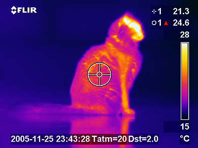

### Energin strålar bort

#### Experiment med IR-kamera

     1. En kopp med kallt vatten och en med varmt vatten ser lika ut för våra ögon men hur ser IR-kameran dem? Vilken kopp avger mest energi i form av strålning? Ljusa färger (vit-gul) är hög temperatur och mörka färger (mörkblå-svart) är låg temperatur.
*Om vi tittar på bilden av katten ser vi ett exempel på en skala. Vit-gul har högst temperatur, därefter rött och lägst är de mörka färgerna blå-svart.*

     2. Undersök om följande föremål är *genomskinliga* (kan du se koppen med varmt vatten genom materialet) för IR-strålning:

         a) Glasskiva. *I regel ej genomskinlig. Finns olika glassorter.*
         b) Träskiva.
         c) Plastskiva. *I regel ej genomskinlig. Finns olika plastsorter.*
         d) Aluminiumfolie. *Försök hålla ytan slät. Ej genomskinlig.*
         e) Svart sopsäck. (Stoppa in din arm, kan man räkna fingrarna?) *Plasten är genomskinlig.*
         f) Solskydd för bilfönster. *T.ex. Biltema har plast för både uv och IR. Ej genomskinlig? (kan vara delvis genomskinlig, anges ofta i någon procentsats).*
         g) Valfritt. *T.ex. papper är ej genomskinligt.*

*Man kan även i detta sammanhang ställa frågan om något av föremålen reflekterar IR-strålning.*

     3. Om man tittar på en människokropp med hjälp av en IR-kamera kan man se hur temperaturen varierar. Sjukdomar kan detekteras med en IR-kamera. Var har du högst respektive lägst temperatur på din kropps hud? 

     4. Om du har en mobiltelefon undersök om den kan detektera ljuset från en fjärrkontroll (IR-diod) med hjälp av mobilens kamera.

     5. Undersök er skola.

         a) Var förlorar ert skolhus sin energi?
         b) Var är det speciellt varmt i er skola? Var är det kallt?
         c) Kan IR-kameran se om elementen är på?
         d) Kaffeautomat, fläktar, fönster, lampor...

#### Information

Föremål med hög temperatur lyser: järn i en smältugn lyser rött, solen är 6000 °C på ytan och lyser vitt för våra ögon. *’Yta’ är inte ett korrekt begrepp.*

Föremål med temperaturen 1300 °C lyser för våra ögon med en bländande vit färg; glasögon som skyddar mot ultraviolett (UV) strålning behövs. Vid 950 °C är föremål röda mot orange, och nedåt 500 °C svagt mörkt röda. Vid lägre temperaturer strålar föremål fortfarande men med ljus som inte är synligt för våra ögon. Ett föremål vid rumstemperatur, ca 20 °C, sänder inte ut någon strålning som människan kan se; strålningen som sänds ut ligger i det infraröda (IR) området och längre våglängder, se figur 1. 

Alla föremål avger således elektromagnetisk strålning oavsett temperatur. Universum har en temperatur på cirka  -270 °C, denna strålning kallas för den kosmiska bakgrundsstrålningen och är i mikrovågsområdet.

Med hjälp av en IR-kamera kan vi detektera den infraröda strålningen från föremål i vår omgivning. Eftersom även osynlig infraröd ’färg’, beror på temperaturen kan vi bestämma föremålets temperatur genom att observera ’IR-färgen’ med hjälp av IR-kameran.

#### Kamerans funktion

Eftersom vi inte kan se ’IR-färgerna’ ändrar IR-kameran dem till för oss synliga färger, en slags kod. I regel väljer kameran ljusare färger (ljusröd-gul-vit) för högre temperaturer och mörkare färger (mörkblå-svart) för lägre. 

*Ibland ändrar kameran sin skala beroende på hur stora skillnader i temperatur det är i bilden; då stannar den en stund och kalibrerar om skalan. Temperaturen som anges av kameran gäller för bildens mitt. Kameran har 2 linser så den tar en vanlig bild i det synliga området, letar upp kanter i den bilden och lägger sedan kanterna på IR-bilden; detta för att du lättare ska kunna hitta föremålen. *

En IR-kamera detekterar elektromagnetiska vågor, typiskt, vilket är längre våglängder än synligt ljus som är. Se figur 1.

*Kameran detekterar IR-strålning inom ett viss våglängdsområde som sedan avbildas på ett för våra ögon synligt våglängdsområde (färger som vi kan se). Elektromagnetiska vågor med våglängder fråntill  kallas för Infraröda vågor.*

En tankeväckande fråga i sammanhanget. Kan användas som uppföljning/fördjupning:

Från en järnbit med temperaturen  1300 °C kommer så mycket UV-strålning att vi måste skydda våra ögon med UV-skydd. Från solen som är  6000 °C borde det komma mycket stora mängder UV-strålning. Trots det kan vi se ett kort ögonblick på solen utan att ögonen blir förstörda, hur kan det vara så?
 
*Svarsförslag: UV-strålningen absorberas av atmosfären. Ozon absorberar mer än 99% av UVC och cirka 90% av UVB och 50% av UVA. Enligt NASA skulle Jordens yta steriliseras om inte atmosfären absorberade UV-strålningen.*

*Bilder från en IR-kamera. 
I bilden nedan framgår skalan för färg. Temperaturen mäts i mitten av bilden.
Kameran mäter temperatur genom att mäta spektrat i det infraröda området. Den luras lätt av reflektioner. Den utgår också från att kroppen som man mäter på är en absolut svart kropp. En absolut svart kropp är en kropp som absorberar all infallande strålning, i detta fall i det område som kameran mäter, d.v.s. absolut svart i det infraröda området. Emissiviteten, , brukar vara inställd på 0,95.
Metaller och reflekterande ytor är ett problem men man kan måla föremålet svart eller sätta svart tejp där man ska mäta. Dock inte glansig svart färg.*
*Kameran genererar två bilder, en i IR och en i synligt. Kanter beräknas från bilden i synligt och överlagras på IR-bilden. Detta kan ändras. Parallaxfel kan uppstå, linserna sitter ovanför varandra.*

*Glaskärl med varmt respektive kallt vatten.*

