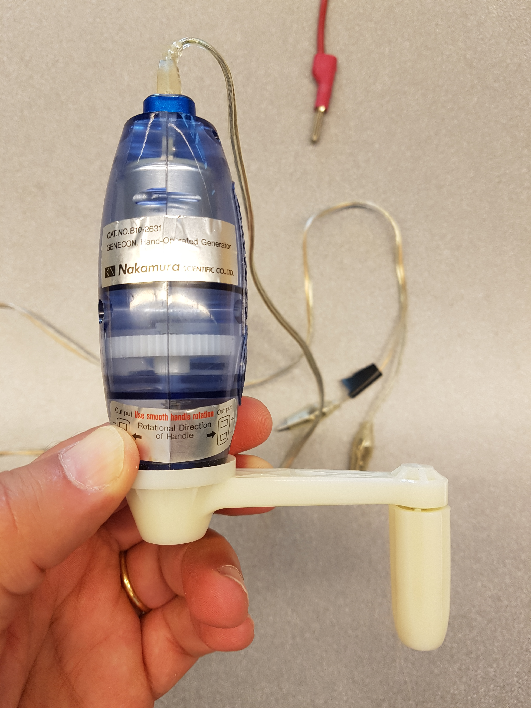

### Generator

#### Frågeställningar

Hur mycket energi kan man få från en elektrisk generator?

#### Materiel

En enkel handdriven generator. Något att mäta spänning och ström med. En stor och en liten resistor, t.ex. 1 Megaohm och 10 ohm.

För att kunna hålla konstant varvtal kan man använda en metronom. Metronomer finns som applikation för mobiltelefoner. Apparna ’Physcis Toolbox Sensor Suite’ och ’Phyphox’ kan också användas.

#### Experiment

    • Veva generatorn runt med olika varvtal (rpm) och undersök vilken effekt som erhålls.

    • Variera resistansen från stor (ingen belastning, väldigt liten effekt) till liten (stor belastning, relativt större effekt). Vilken effekt erhålls?

Uppföljning

    • Hur känns det att veva vid stor (liten resistans) respektive liten (stor resistans) belastning? Varför är det så?

    • Måste en generator rotera fort, varv per minut, för att ge mycket elektrisk energi?

    • Vilka faktorer bestämmer hur mycket energi man kan få ut ur generatorn?

    • Energi kan varken skapas eller förintas. Varifrån kommer den elektriska energin som generatorn levererar?

    • I ett vindkraftverk driver vinden generatorn. Måste ett vindkraftverk snurra fort för att ge mycket elektrisk energi?

    • Vad driver generatorn i ett kärnkraftverk?