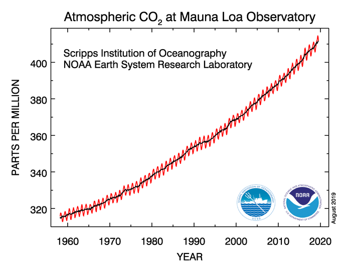
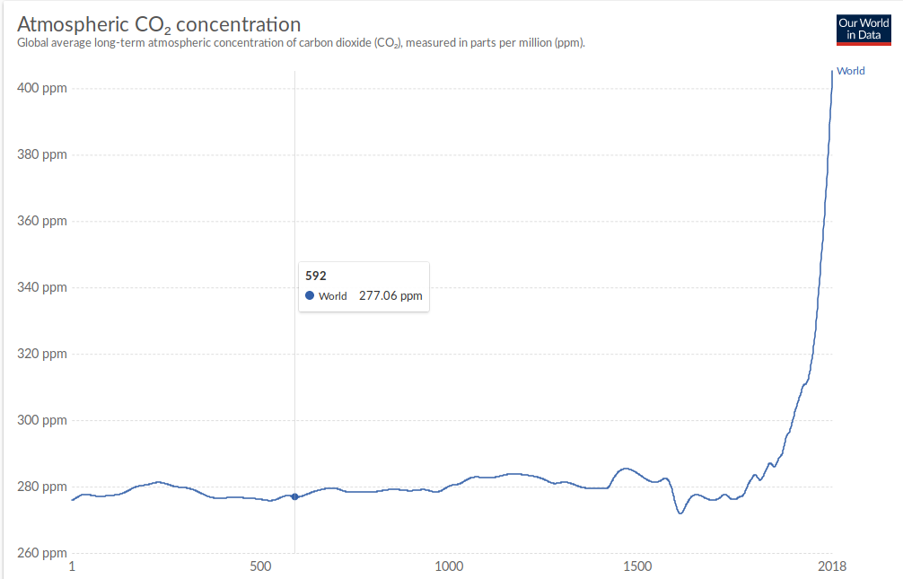

### Procent, promille och ppm

Procent innebär att man räknar hundra-delar. En hundradel är således en procent. 34 hundradelar är 34 procent, skrivs oftast som 34 %.
34 % är matematiskt 34/100=0,34. 15% är 15/100=0,15.

Promille innebär att man räknar tusen-delar. En tusendel är således en promille. 34 tusendelar är 34 promille, skrivs oftast som 34 ‰.
34 ‰ är matematiskt 34/1000=0,034. 15 ‰ är 15/1000=0,015.

ppm är en förkortning för det engelska uttrycket ’parts per million’ vilket betyder miljondelar. ppm innebär därför att man räknar i miljon-delar. En miljondel är således en ppm. 34 miljondelar är 34 ppm. 34 ppm är matematiskt 34/1000000=0,000034. 15 ppm är 15/1000000=0,000015. 411 ppm är 411/1000000=0,000411.

Begreppen används oftast när man vill beräkna andelar av något.

34 % av 135 kronor innebär att man delar in 135 kronor i hundra delar och sedan tar 34 av dessa. Matematiskt skrivs det d.v.s 45,9 kronor. Man kan också tänka. Det är samma sak.

34 ‰  av 135 kronor innebär på liknande sätt , d.v.s. 4,59 kronor. Eller.

34 ppm av 135 kronor är , d.v.s. 0,00459 kronor. Eller .

Och 411 ppm är, d.v.s. 0,055485 kronor. Eller .

I samband med gaser har vi t.ex. 411 ppm av ett visst antal molekyler (man kan välja en mol molekyler t.ex.).

Om vi har 37 000 000 (37 miljoner) molekyler och 4 % av dem är koldioxidmolekyler så finns det  koldioxidmolekyler, d.v.s. en miljon fyrahundraåttiotusen stycken av 37 000 000 molekyler är koldioxidmolekyler.

Om vi bara har 4 ‰ koldioxidmolekyler så är det 148 000 stycken av 37 000 000 molekyler som är koldioxidmolekyler.

Och 4 ppm av 37 000 000 är , d.v.s. endast 148 stycken är koldioxidmolekyler. 

Om vi har 411 ppm så är det .

Koldioxidhalten i atmosfären var i början på 2019 411 ppm. Det innebär att 411 miljondelar av antalet molekyler var koldioxidmolekyler. Det kan också uttryckas som att 0,0411% av antalet molekyler var koldioxidmolekyler. Jämförelsevis är 78% kväve och 21% syre.
Året tidigare var halten koldioxid 408 ppm.
Innan människan började med industrier (slutet av 1700 talet börjar den s.k. Industriella revolutionen) var koldioxidhalten något under 300 ppm. I grafen nedan (översta grafen) kan du se hur koldioxidhalten i atmosfären varierat vid Mauna Loa (Hawaii) observatoriet sedan 1960. I den nedersta grafen ser du medelvärde globalt av koldioxidhalten från år 0.

Övre figuren är data från NOAA och Global Greenhouse Gas Reference Network (NOAA: National Oceanic and Atmospheric Administration, USA).

Nedre figuren hämtad från Our World in Data (University of Oxford).
https://ourworldindata.org/grapher/co2-concentration-long-term

