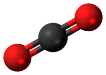

### En människa i kammaren

#### Frågeställning

Hur tror du att koldioxidhalten i ett rum påverkas av att det finns människor i ett rum och olika aktiviteter som de utför?

#### Materiel

1 kammare på ungefär 1 kubikmeter.
Utrustning för mätning av koldioxidhalt kontinuerligt.
En lykta med stearinljus eller en fotogenlampa. Hantlar.

#### Experiment

I stället för att direkt mäta i ett vanligt rum med människor mäter vi i ett litet rum, en kammare, och med endast en människa. Försök sedan dra slutsatser om vad som händer i ett helt rum med många människor.

    • Kontrollera att utrustningen fungerar. Mät koldioxidhalten i kammaren utan någon person i den.

    • Placera en glödlampa i kammaren och observera vad som händer med temperatur, luftfuktighet och koldioxidhalt.

    • En person sätter sig inne i kammaren. Andas inte direkt på mätutrustningen. Vifta lugnt med t.ex. ett litet kollegieblock två gånger varje minut. Avläs koldioxidhalten; sitt inte så länge att luften känns obehaglig. Anteckna koldioxidökningen och tiden som personen varit i kammaren.

    • Vädra ut kammaren så koldioxidhalten sjunker tillbaka till normalt värde.

    • Upprepa laborationen igen, men låt personen hoppa hopprep, göra armhävningar eller springa upp och ner i trappan innan personen placerar sig i kammaren.

    • Vädra ut kammaren så koldioxidhalten sjunker tillbaka till normalt värde.
    • Låt en person sitta i kammaren och hålla andan i en minut. Vad händer med mätresultaten?

    • Ställ in en lykta med låga och mät ändringen i koldioxidhalten. Jämför mätresultaten med när en person sitter i kammaren.

#### Uppföljning

    • Varifrån kommer koldioxiden i klimatkammaren?

    • I vilket experiment skapas mest koldioxid? Hur fort går det?

    • Uppskatta tiden det skulle ta att komma upp i 1000 ppm för en person i kammaren; för en låga?

    • Vad kommer att hända med koldioxidhalten i ett rum med 200 kubikmeter och 30 människor?

#### Information

Lågan är ett exempel på förbränning. Din kropp förbränner din mat, vid de flesta industriella processer används någon form av förbränning, i en bilmotor sker en förbränningsprocess, ett flygplan har en förbränningsmotor o.s.v.

Alla djur och all förbränning (syre) producerar koldioxid. Kammaren kan vara ditt klassrum, din stad, ditt land, din planet.

När man bränner upp 1 kg olja eller bensin, frigörs ungefär 12 kWh (kilowattimmar) energi. Samtidigt leder det till ett utsläpp av drygt 3 kg koldioxid. För varje kg utsläppt CO2 får man alltså ut cirka 4 kWh energi.

Normal koldioxidhalt, över marina ytor, var februari 2019 enligt NOAA och Global Greenhouse Gas Reference Network 411 ppm. Ett år tidigare var den 408 ppm. (NOAA: National Oceanic and Atmospheric Administration, USA) Förindustriellt värde är något under 300 ppm, uppgifter varierar mellan 260 och 290 ppm. Över längre tid så fluktuerar värdena mellan 200 och 300 ppm över någotsånär cykliska perioder på 100 000 år de senaste 800 000 åren.